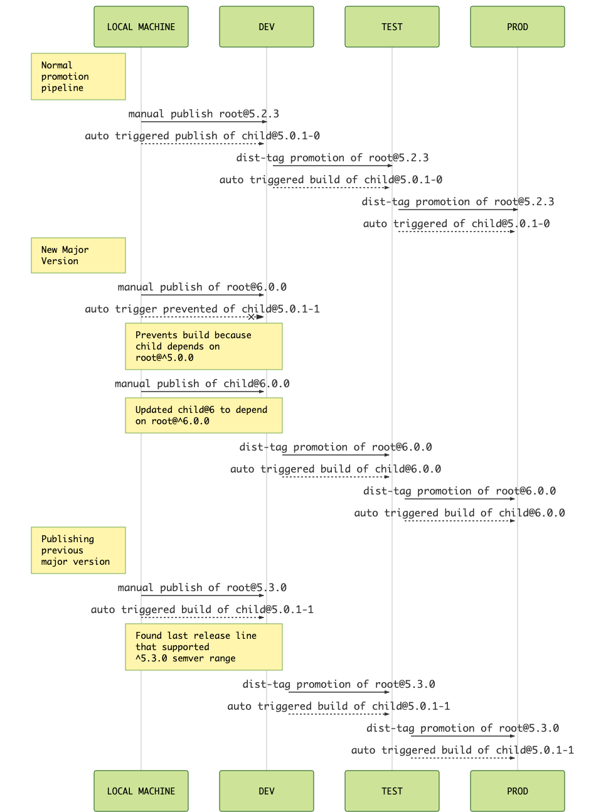

# feedsme

[](https://circleci.com/gh/godaddy/feedsme)
[](https://travis-ci.org/godaddy/feedsme)

Feedsme is a micro service that receive build completion notifications
from [carpenterd]. When these notifications are received we will try to find all
dependent modules on the package that was just build and send them in for
re-build in [carpenterd].

This ensures that all dependencies on your packages are always updated.

## Architecture overview

When `carpenterd` queues a build it will trigger a `POST /change` on the Feedsme
microservice with the `package.json` contents of the package that was built. The
package.json is then processed in a few ways to allow tracking and triggering of
dependent packages to be built. To make it concrete, a dependent package of
package `A` would be package `B` if `B` has `A` as a dependency. So now if a new
version of `A` is published, a dependent build will be triggered for `B` to get
the changes made to `A`. The latest work we have done to this project, creating
a `release-line` data structure ensures that this is safely based on the given
`semver` ranges. Lets start to get into the specifics

## `release-line`

A `release-line` encapsulates the association between package `A`, and the
version it was published as along with the associated package `B` with its
auto-incremented version that was published as a result of this system. With
every publish we now know for certain which version of package `B` will be
promoted along side package `A` as we move from `DEV -> TEST -> PROD`.

### Resolve Dependents and DependentOf

The first step of processing a `change` event is to resolve the `Dependent`
packages of the package sent to feedsme as well as resolve any possible
DependentOf packages. We do this currently by inspecting the dependencies in the
given package, and seeing which ones are also managed by warehouse. From this
filtered list of packages, we then create the dependent mapping. The dependency
itself being the root or parent package like `A` is above and the dependent
being the child, similar to package `B`. Dependents is a lookup for the parent
Package which has an array of the packages that depend on it.

DependentOf is the inverse of Dependent and rather than an array, assumes
a single value. We don't allow there to be multiple parent packages for a given
dependent. So the DependentOf record is created with the lookup being the
dependency itself, like package `B` with the `dependentOf` value being the
parent or package `A`.

These lookup tables are then used in the next step.

## Trigger dependents or update `release-line` with dependentOf

We now use these lookup tables to make decisions around triggering dependent
packages and/or adding a dependent to the given `release-line`. Here we have
a 2 different scenarios that influence our course of action.

1. We are a publish, this is the only time a release-line is created for the
   given package and is also the only time a release-line can have a dependent
   added to it. This is because new versions only happen in DEV.

   If we are a package that has dependents, this is the only time the version of
   the dependent package gets automatically incremented based on the version of
   the parent package and the semver range of the dependent's dependency on the
   parent package. It is also possible to not build dependents in DEV if we have
   detected that a manual publish of the dependent package(s) is(are) essential
   due to the semver range of the dependent's dependency on the parent package.

2. We are a promotion from `DEV -> TEST` or `TEST -> PROD`. We implicitly use
   the `release-line` versions created on the initial publish of the package to
   use for promoting the correct version of dependent packages.

Below we have diagrams of specific cases that we handle.

## Dependent Builds Diagram

The premise for this diagram is that we have a package `child@5.0.0` that
depends on package `root@^5.0.0`. From here we go through a sequence of
publishes and promotions via the typical warehouse system workflow.



## Tests

[Cassandra] should be running local. It can be installed through
[homebrew] for MacOS or run the docker container from [docker hub][hub].

```sh
npm test
```

[carpenterd]: https://github.com/godaddy/carpenterd
[Cassandra]: https://cassandra.apache.org/
[homebrew]: http://brew.sh/
[hub]: https://hub.docker.com/_/cassandra/
